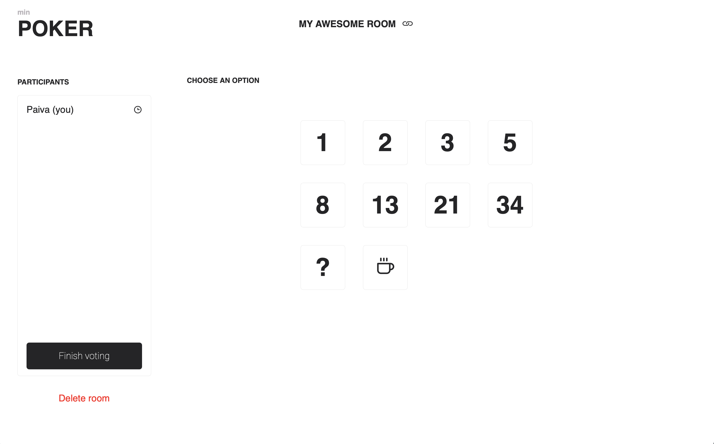

# minPOKER

Here's a minimal and simple planning poker game.

# :runner: Getting Started

When you download or clone this repo, enter the project folder and just run `yarn dev`. 🎉

# 🤲🏼 Contributing

Feel free to contribute with this repository or suggest better way to do it. Thank you!
